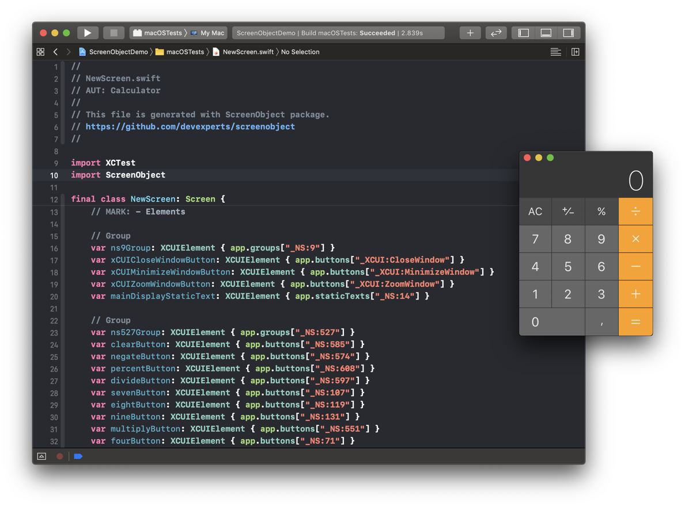

# ScreenObject
---
ScreenObject implements ScreenObject (PageObject) pattern in your tests. 
It also automatically generates Screen classes of XCUIElements.
ScreenObject is useful in User Interface testing of iOS, iPadOS, tvOS, and macOS. 
This tool supports testing on the devices and in iOS/iPadOS Simulator. 
It has been designed to be used with XCTest and written in Swift.

## Installation
ScreenObject is easy to install with the [Swift Package Manager.](https://developer.apple.com/documentation/swift_packages) 
Navigate to project settings and add a package on the **Swift Packages** page. 
Copy-Paste a link to this repository in the **Choose Package Repository** window. 
Continue configuring dependency as needed.


## ScreenObject concepts 
1. Import `ScreenObject` anywhere you import `XCTest`.
2. Define ScreenObject classes with elements and steps as subclasses of `Screen`.
3. Elements should be computed properties. 
4. If you want to use steps chained together, steps functions shall return `self`.
5. Use `Screen(of: app)` in your `XCTestCase` subclasses to access ScreenObjects' chaining.
6. To navigate between different ScreenObjects use `on(NewScreen.self)` function.
```swift
import XCTest
import ScreenObject

class MainScreen: Screen {
    var settingsButton: XCUIElement { app.buttons["Settings"] }

    @discardableResult
    func openSettings() -> Self {
        settingsButton.tap()
        return self
    }
}

class SettingsScreen: Screen {
    var logOutButton: XCUIElement { app.buttons["Log Out"] }
    var alert: XCUIElement { app.alerts.element }

    @discardableResult
    func logOut() -> Self {
        logOutButton.tap()
        return self
    }

    @discardableResult
    func checkLogOutAlert() -> Self {
        XCTAssertEqual(alert.label, "You have successfully logged out")
        return self
    }
}

class ExampleTestCase: XCTestCase {
    func testLogOut() {
        given("User opens the app") {
            XCUIApplication().launch()
        }
        when("User goes to the settings and logs out") {
            on(MainScreen.self)
                .openSettings()
                .on(SettingsScreen.self)
                .logOut()
        }
        then("User sees the alert") {
            on(SettingsScreen.self)
                .checkLogOutAlert()
        }
    }
}

```

## Handy extensions for XCTest 
```swift
public extension XCUIApplication {
    // Returns a query for all descendants of any type.
    // Also available for XCUIElement and XCUIElementQuery.
    var anyElements: XCUIElementQuery { }
}

public extension XCUIElement {
    // Types delete symbols into the element.
    func clearText() { }

    // Sends a tap event at the element's coordinate. Useful if the regular .tap() fails.
    func tapUnhittable() { }

    /// Waits the specified amount of time for the element’s exists property to become false.
    ///
    /// - Returns: false if the timeout expires and the element still exists.
    func waitForDisappearance(timeout: TimeInterval = 3) -> Bool { }
}

public extension XCUIElementQuery {
    // The last element that matches a query
    var lastMatch : XCUIElement { }
}

public extension XCTest {
    // Functions for organising test cases code
    func given(_ note: String, block: () throws -> Void) rethrows { }
    func when(_ note: String, block: () throws -> Void) rethrows { }
    func then(_ note: String, block: () throws -> Void) rethrows { }

    // A more compact version of XCTContext.runActivity<Result>(named name: String, block: (XCTActivity) throws -> Result) rethrows -> Result
    func step<Result>(named: String, block: () throws -> Result) rethrows { }
    
    // Adds note into the test log
    func addNote(_ note: String) { }
}
```

## ScreenObjects' generation
1. Import `XCTest` and `ScreenObject`
2. Use `add(app.generateScreenObject())` to generate ScreenObject
3. Navigate to the test report to see the generated ScreenObject
```swift
import XCTest
import ScreenObject

class ExampleTests: XCTestCase {
    let app = XCUIApplication()

    override func setUp() {
        app.launch()
    }

    func testGenerate() {
        add(app.generateScreenObject())
    }
}
```



## License 
ScreenObject is the open-source software under [the MPL 2.0 license.](LICENSE)
